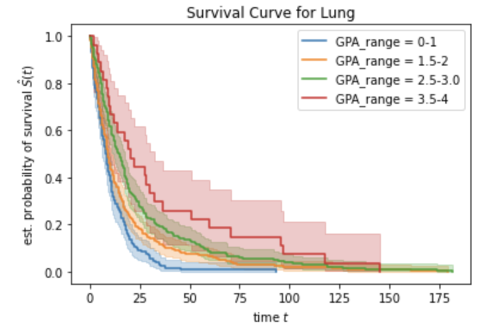
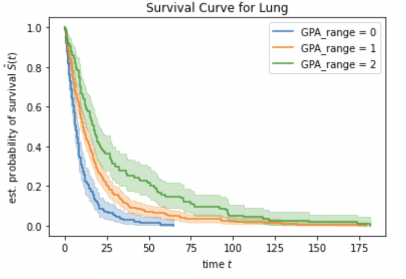

### MOTIVATION:

This project was executed as a part of our internship at UCSF. Superduto et all developed a clinical methodology(Diagnosis-specific Graded Prognostic Assessment) to segment patients by the severity of cancer so that they have well-separated survival times and develop an estimated time for each patient. However, for UCSF patients, we observed the following:

1) patients lived far longer than predicted 
2) Additionally, there was a significant overlap in the patient survival times between the GPA classes.

Our objective was to show that the old model did not fit the observed data, and develop a new model. 

### DATASET

Tabular data of patients suffereing from Brain Metastatic Cancer and clinical attributes of the patients such as Age, Sex etc.

The target variable was time of death 

#### MODEL:

We used a decision tree model to predict the time of death. The predictions from the model were used to decide which classes the patient belonged to. For instance, if the tree predicted two leaves, the patient belonging to the leaf node with a lower mean survival time would be assigned class zero and the patient belonging to the other leaf node class one.

We then fit a Kaplan Meier Survival curve on the classes produced to see a graphical/statistical separation of survival times.

#### FOR LUNG CANCER

#### ORIGINAL

#### OUR MODEL

##### 3 Classes

